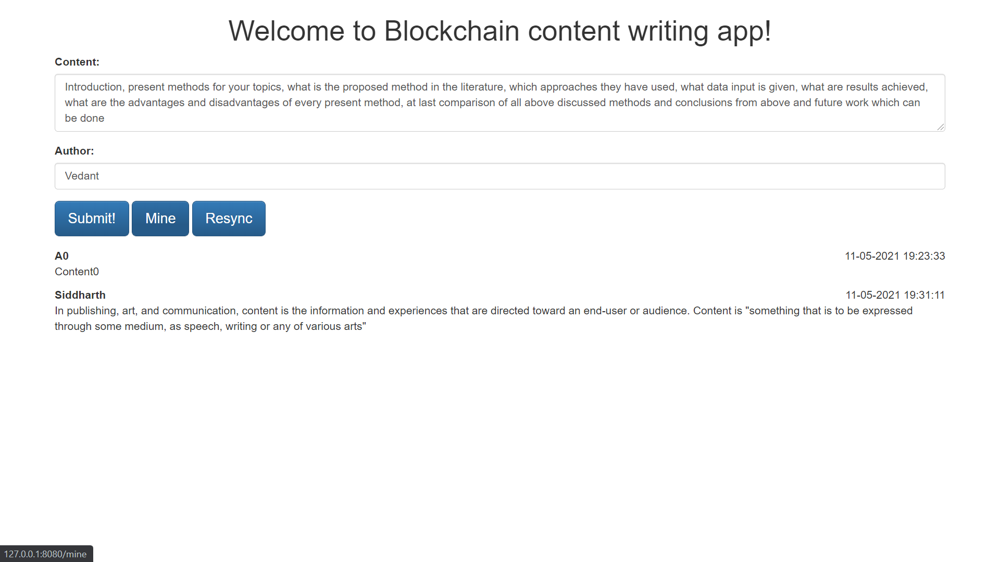
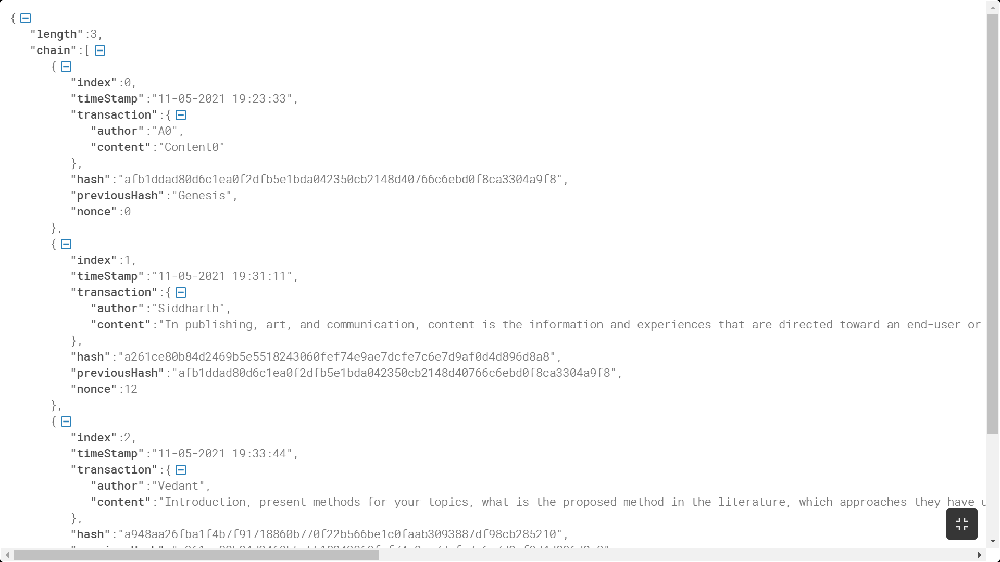

# Blockchain API ( with content sharing app to demonstrate )

## Instructions to run

Clone the project,

```sh
$ git clone https://github.com/Sid330s/Blockchain-API.git
```

Install the dependencies auto as MAVEN used,

Start a blockchain node server,

```sh
# Windows users can follow this: https://flask.palletsprojects.com/en/1.1.x/cli/#application-discovery
$ mvnw spring-boot:run -Dspring-boot.run.arguments=--server.port=8080
```

One instance of our blockchain node is now up and running at port 8080.


Run the frontend application on a different terminal session,

```sh
$ cd Blockchain Frontend
$ node index.js
```

The application should be up and running at [http://localhost:8000](http://localhost:8000).

Here are a few screenshots

1. Posting some content and Requesting the node to mine



2. Resyncing with the chain for updated data


3. View History of Blocks in Blockchain



To play around by spinning off multiple custom nodes, use the `register_with/` endpoint to register a new node.

Here's a sample scenario that you might wanna try,

```sh
$ mvnw spring-boot:run -Dspring-boot.run.arguments=--server.port=8010
$ mvnw spring-boot:run -Dspring-boot.run.arguments=--server.port=8020
$ mvnw spring-boot:run -Dspring-boot.run.arguments=--server.port=8030
```

You can use the following cURL requests to register the nodes at port `8010` and `8020` with the already running `8080`.

```sh
curl -X POST \
  http://127.0.0.1:8010/registerWith \
  -H 'Content-Type: application/json' \
  -d '{"nodeAddress": "http://127.0.0.1:8080/"}'
```

```sh
curl -X POST \
  http://127.0.0.1:8020/registerWith \
  -H 'Content-Type: application/json' \
  -d '{"nodeAddress": "http://127.0.0.1:8080/"}'
```

This will make the node at port 8000 aware of the nodes at port 8001 and 8002, and make the newer nodes sync the chain with the node 8000, so that they are able to actively participate in the mining process post registration.

To update the node with which the frontend application syncs (default is localhost port 8000), change `CONNECTED_NODE_ADDRESS` field in the

Once you do all this, you can run the application, create transactions (post messages via the web inteface), and once you mine the transactions, all the nodes in the network will update the chain. The chain of the nodes can also be inspected by inovking `/chain` endpoint using cURL.

```sh
$ curl -X GET http://localhost:8010/chain
$ curl -X GET http://localhost:8020/chain
```
